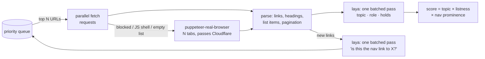

# laya-scraper

**Give it a homepage. It finds where the site keeps its publications, works out how that list pages, and pulls the facts out of each publication.**

Two stages:
- **`scrape.py`** finds the place: which page is the publications list, plus a map of what every other section holds.
- **`list.py`** walks that list, including next links, load-more buttons and "view all" pages, and extracts each publication's title, date, authors, summary, PDF, DOI and type.

```
$ python scrape.py https://odi.org/en/
laya on cuda: NVIDIA GeForce RTX 4080 SUPER
[  1] 0.25 hub=0.30 hub     events        items=  8 requests https://odi.org/en/
[  2] 0.31 hub=0.31 listing organisation  items= 28 requests https://odi.org/en/about/our-work/
[  3] 0.23 hub=0.23 listing events        items= 20 requests https://odi.org/en/events/
[  4] 1.00 hub=1.00 listing publications  items= 20 browser  https://odi.org/en/publications/
[  5] 0.35 hub=0.97 item    publications  items=  2 requests https://odi.org/en/publications/beyond-sovereignty-...
...
{
  "answer": "https://odi.org/en/publications/",
  "sections": {
    "publications": "https://odi.org/en/publications/",
    "events": "https://odi.org/en/events/",
    "organisation": "https://odi.org/en/about/our-work/",
    ...
  }
}
```

There are no per-site rules, CSS selectors or keyword lists. The crawler reads pages much as a person would: the menu, the headings, and whether the page is a list of things. A small non-generative decision model, [laya](https://github.com/NandhaKishorM/laya), makes the judgment calls in milliseconds on the GPU.

## Results

The same code and settings were used on each site, with a budget of 30 pages:

| Site | Found | Score | Time | Notes |
|---|---|---|---|---|
| odi.org/en/ | [`/en/publications/`](https://odi.org/en/publications/) | 0.99 | ~33 s | The page is behind Cloudflare and its list loads with JS. Plain HTTP gets a 403, so the page is fetched with the real browser. |
| chathamhouse.org | [`/publications/research-publications`](https://www.chathamhouse.org/publications/research-publications) | 0.90 | ~34 s | The whole site is bot-walled, so it switches to browser-only. Its items live under dated paths (`/2025/12/…`), not under the list page. |
| brookings.edu | [`/research-commentary/`](https://www.brookings.edu/research-commentary/) | 0.38 | ~29 s | The list loads with JS and items live at `/articles/…`. It beats the homepage by a small margin. |

The full reports, with every page visited and classified, are in [`examples/`](examples/): `*.json` holds the report and `*.log` the crawl trace.

## Stage 2: the full list and the facts (`list.py`)

```
$ python list.py https://www.chathamhouse.org/
stage 1: list is https://www.chathamhouse.org/publications/research-publications
stage 2: paging through the list ...
  page 1: 30 items at /*/*/ via browser
  no pagination here; following 'View all research publications' -> .../search/content_format/Research%20publication
  page 1: 10 items at /*/*/ via browser
  page 2: +10 items (20)
  page 3: +10 items (30)
  page 4: +10 items (40)
stage 3: reading 40 publications ...
  2026-09-20 academic        The problem with biofuels as a response to the Gulf energy supply shock   Patrick Schröder
  2026-06-01 report          Saving global economic governance from the ‘Trump shock’                  Creon Butler
  ...
```

How to reach the next page is worked out for each site. Nothing is hard-coded. It tries these in order:

| Strategy | When | Seen on |
|---|---|---|
| **next-link** | A `rel=next`, "Next ›" or "Load more" link, or the numbered link to page N+1 | ODI (`?page=2` of 407), Chatham House (`?page=1`, counting from 0) |
| **load-more** | A JS button or infinite scroll. The real browser clicks or scrolls until it has enough items | Brookings (Algolia "Show More", about 51k results) |
| **view-all** | A curated landing page with no pagination: follow its "View all …" link and start over there | Chatham House |
| **probe** | No visible control: try `?page=`, `?paged=`, `?p=` and `/page/N/`, and keep whichever returns *new* items | Fallback |

**Item detection.** The list's entries are the group of content links sharing a path pattern, with titles and slug-like URLs. That keeps author facets and tag links out. Collection stops at **`--max-items` (default 40)**, so ODI's 407 pages cost two page loads.

**Facts** come from structured metadata first: JSON-LD, the `citation_*` tags that Google Scholar reads, and OpenGraph. Page content is the fallback: `<h1>`, `<time>`, author links with social handles and "See more" filtered out, and PDF and DOI links. laya then labels each item's **kind**: report, brief, working paper, academic, book, commentary, media, event or other. The site's own list label ("Research paper …") is its strongest hint.

| Site | Paging | Items | Date | Authors | PDF | DOI | Time |
|---|---|---|---|---|---|---|---|
| ODI | next-link, est. 407 pages | 40 | 40 | 38 | 37 | 0 | ~51 s |
| Brookings | load-more (3 clicks) | 39 | 39 | 26 | 33 | 4 | ~49 s |
| Chatham House | view-all → next-link, est. 37 pages | 40 | 40 | 40 | 40 | 40 | ~100 s, including stage 1 |

Each run is in `examples/*-items.csv`, which opens in Excel, and `*-items.json`. One item looks like this:

```json
{"url": "https://www.chathamhouse.org/2026/09/problem-biofuels-response-gulf-energy-supply-shock",
 "title": "The problem with biofuels as a response to the Gulf energy supply shock",
 "date": "2026-09-20", "authors": ["Patrick Schröder"], "kind": "academic", "kind_confidence": 0.40,
 "summary": "The global push for energy security post-Hormuz cannot come at the cost of food insecurity and deforestation.",
 "pdf": "https://www.chathamhouse.org/sites/default/files/2026-09/2026-09-22-problem-with-biofuels-schroeder-bharadwaj-king.pdf",
 "doi": "10.55317/9781784136871"}
```

```
python list.py https://odi.org/en/                                  # stage 1 + 2
python list.py --hub https://odi.org/en/publications/               # skip discovery
python list.py https://odi.org/en/ --max-items 200 --out odi.csv    # .csv or .json
```

## How it works (stage 1)



1. **Best-first, batched crawl.** Each round takes the most promising URLs from a priority queue and fetches them in parallel.
2. **Two fetchers, chosen per page.** It tries plain `requests` first because it's fast. A page goes to a real Chrome, via [puppeteer-real-browser](https://www.npmjs.com/package/puppeteer-real-browser), when:
   - it is blocked (403/429/503),
   - it is a thin JS shell,
   - or laya says it's on-topic but the static HTML lists no items, which means the list loads with JS.

   If most of a batch is bot-walled, the whole site switches to the browser. The browser runs several tabs, and they share cookies, so a Cloudflare challenge is solved once per site.
3. **laya judges meaning.** Every page is classified in one batched pass:
   - **topic**: is this page about the target?
   - **role**: list, single item, hub or info page
   - **holds**: publications, news, events, people, jobs, media, projects, organisation or mixed
4. **Structure judges list pages.** List items are titled links in the main content, with nav, header and footer removed, grouped by path pattern with numbers wildcarded (`/2025/12/x` ≈ `/2026/01/y`). The page structure also contributes pagination and PDF/date counts.
5. **The final score** combines the three signals: `topic × (0.2 + 0.8·listness) × (0.6 + 0.4·prominence)`. Prominence is the share of crawled pages that link to the candidate. Real section indexes sit in the site menu; a one-off magazine issue doesn't.
6. **Link priority.** laya scores every new link ("is this the nav link to the site's publications?"). Links with many known pages beneath them get a boost. Once a list is confirmed, its entries are deprioritized, so the budget goes to finding new places instead of reading 30 individual reports.

### Why laya?

The crawler asks hundreds of small yes/no and multiple-choice questions per run. laya answers them in a single forward pass, with no text generation and no prompt parsing, and it batches them: a whole round of links is scored in one GPU call. It also runs on CPU, just slower. It is multilingual, so non-English sites work without changes.

## Quickstart

Needs Python 3.10+ and Node 18+.

```bash
python -m venv .venv
# NVIDIA GPU (recommended). Skip this line for CPU-only:
.venv/Scripts/python -m pip install torch --index-url https://download.pytorch.org/whl/cu128
.venv/Scripts/python -m pip install -r requirements.txt
npm install

.venv/Scripts/python test_parse.py          # structure self-checks, no network → "ok"
.venv/Scripts/python test_list.py           # pagination + fact extraction checks → "ok"
.venv/Scripts/python scrape.py https://odi.org/en/
```

On macOS or Linux, use `.venv/bin/python`. The first run downloads the laya checkpoint.

### Options

| Flag | Default | |
|---|---|---|
| `--target` | `publications (research reports, papers, briefs)` | What to look for, e.g. `"job vacancies"` or `"press releases"` |
| `--max-pages` | 30 | Crawl budget |
| `--max-depth` | 3 | Maximum clicks from the start page |
| `--tabs` | 4 | Parallel fetches and browser tabs |
| `--browser` | `auto` | `always` or `never` force one fetcher |
| `--out` | – | Write the full JSON report of every page visited |

### Output

`answer` is the best URL. `sections` gives, per content type, the most prominent list page. `top` holds the 5 best candidates, and `places` (in `--out`) contains every page visited:

```json
{"url": "https://odi.org/en/publications/", "via": "browser", "depth": 1, "role": "listing",
 "holds": "publications", "hub": 0.9999, "items": 20, "linked_from": 0.967, "score": 0.9867}
```

## About headless and Cloudflare

Cloudflare fingerprints true headless Chrome in every mode (`headless: true`, `'new'`, `'shell'`). So by default the browser is a normal Chrome window placed off-screen, which you never see. On Linux, puppeteer-real-browser runs it under xvfb. `HEADLESS=1` forces true headless for sites without a challenge.

Details that made parallel browsing reliable:
- **Each "tab" is its own off-screen window.** Chrome only fully renders the front tab of a window. Lazy lists in background tabs never loaded (Brookings came back empty), and Cloudflare challenges stalled. Separate windows fix both and still share cookies, so a challenge is solved once per site.
- **A challenge can clear during the first page load** while the recorded status stays 403. The renderer uses Cloudflare's `cf-mitigated` header to tell these cases from a real 403. If the challenge redirect lands while the page is being read, the page is read again.
- **Lists that load asynchronously** are captured only after the page's link count stops changing, not just after the network goes quiet.

## Limitations and next steps

- **Weights are hand-tuned** on three sites. With 20–50 labelled sites they could be fitted, or laya could be fine-tuned on (page → is-hub) pairs; the laya repo ships a fine-tuning notebook.
- **`holds` and `kind` labels are zero-shot and noisy.** For example, an experts page can come out as "news", and Chatham House research papers often come out as "academic". `kind_confidence` is reported with each label. Fine-tuning laya on a few hundred labelled pages is the fix. The `answer` relies on the score, not these labels.
- **Authors without metadata** come from author links on the page. Brookings has no structured author data, so 26 of 39 items have authors.
- **Query strings are dropped** to avoid `?page=` duplicates. This breaks sites that route pages by query (`?p=123`).
- **Lists fed by an API with no page URLs or buttons** (for example, cursor-based XHR) are out of reach. Reading the list's JSON API directly would be the next step.
- **Crawl politely.** There is no robots.txt handling or rate limiting yet. Keep `--tabs` modest on sites you don't own.

## Files

| | |
|---|---|
| [`scrape.py`](scrape.py) | Crawler, parser, laya "brain" and scoring (~300 lines) |
| [`list.py`](list.py) | Stage 2: pagination strategies, item collection and fact extraction (~320 lines) |
| [`render.js`](render.js) | Real-browser worker: parallel off-screen windows, Cloudflare handling, list expansion (load-more and scroll), JSON lines over stdin/stdout (~130 lines) |
| [`test_parse.py`](test_parse.py), [`test_list.py`](test_list.py) | Offline checks: lists vs items vs nav, dated paths, next-link detection, page counts, metadata and fallback extraction |
| [`examples/`](examples/) | Stage 1 reports (`<site>.json`/`.log`) and stage 2 results (`<site>-items.csv`/`.json`/`.log`) for the three sites |

## Credits

The decision model is [laya](https://github.com/NandhaKishorM/laya) by NandhaKishorM (Apache-2.0). Cloudflare-capable browsing comes from [puppeteer-real-browser](https://github.com/zfcsoftware/puppeteer-real-browser).

MIT licensed.
