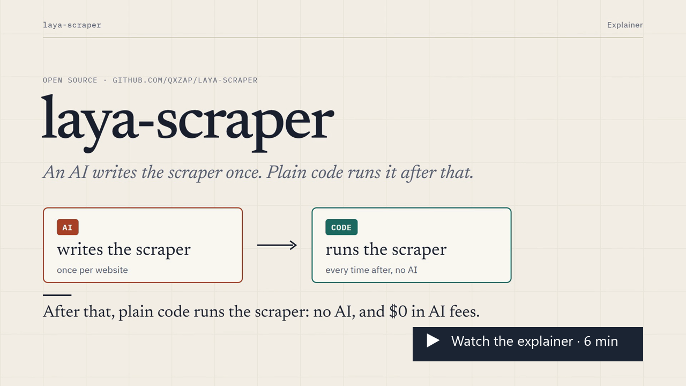
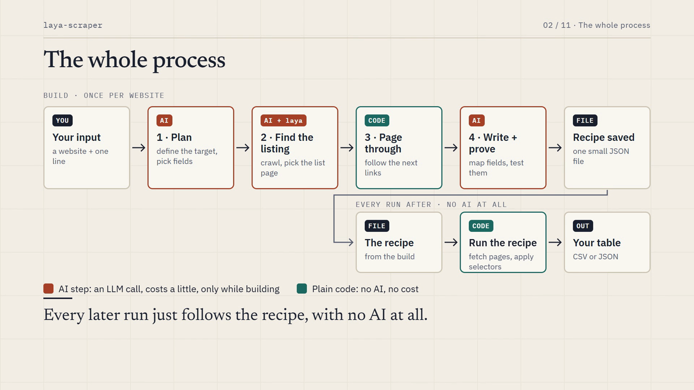
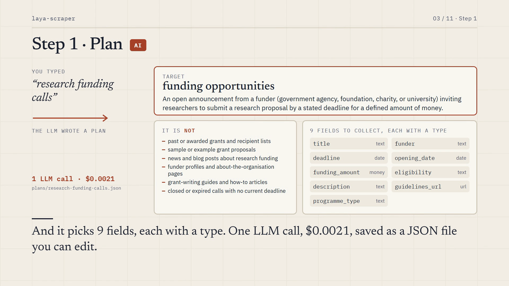
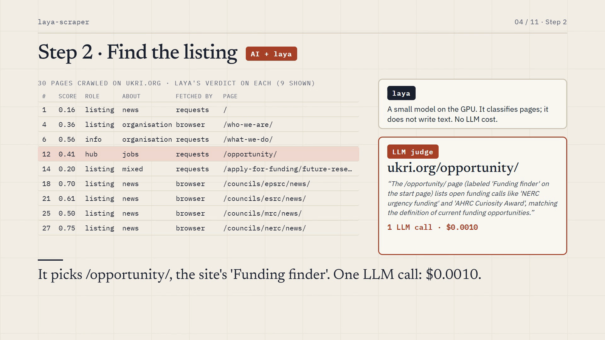
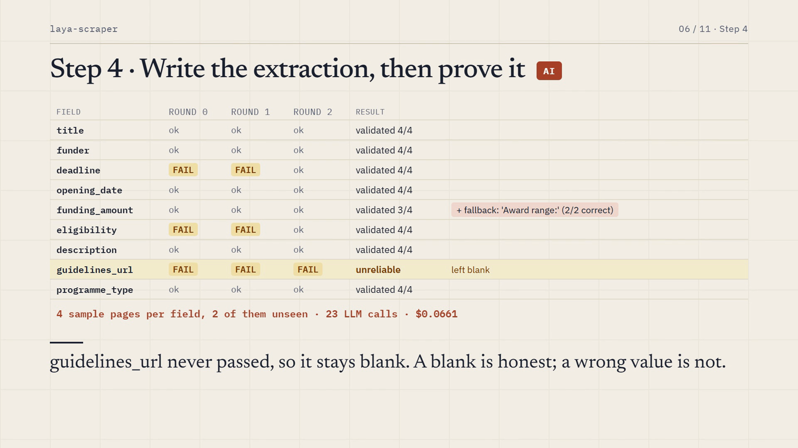
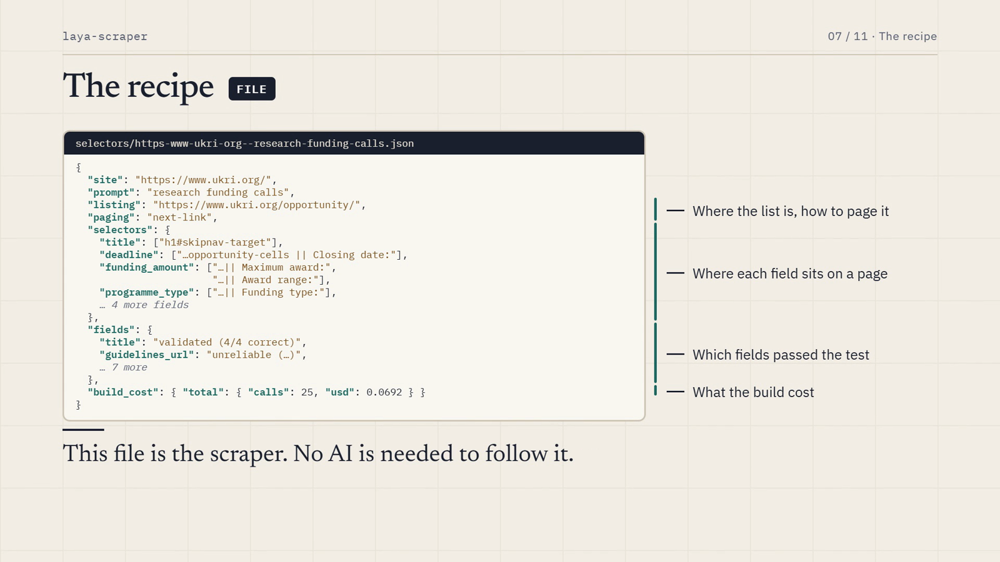
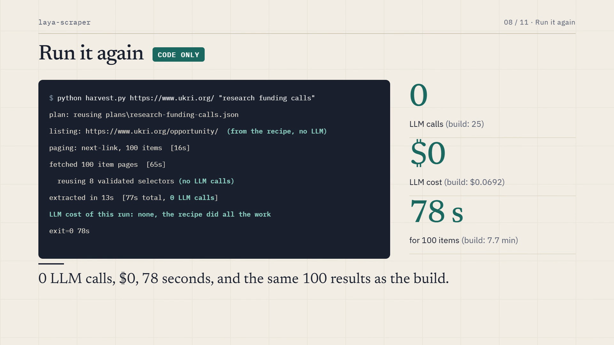
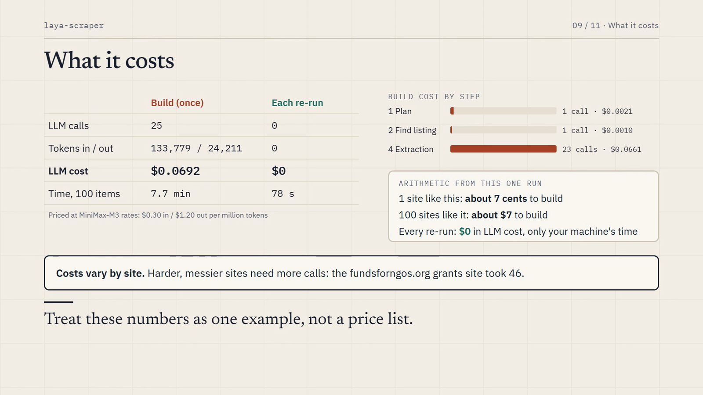
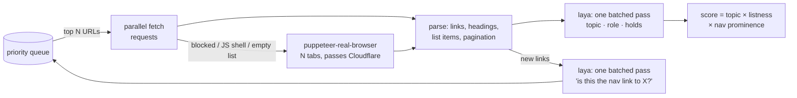

# laya-scraper

**An AI writes the scraper once. Plain code runs it after that.**

Give it a website and one line of plain English: "grants", "patents", "datasets", "policy papers", anything. It finds the listing, pages through it, designs a schema and extracts every item into a table. The AI is used only to *write* a small recipe for that site. Every run after is plain code: no AI, $0, the same answers each time.

Site and explainer video: **[laya.vibe-coding.fans](https://laya.vibe-coding.fans/)**

[](https://github.com/qxZap/laya-scraper/releases/tag/v0.1.0)

▶ **[Watch the 6-minute narrated explainer](https://github.com/qxZap/laya-scraper/releases/tag/v0.1.0)**. The video is attached to the v0.1.0 release. It walks through one real run: from the prompt to the recipe, what each step costs, and the run with no AI.

| | LLM calls | LLM cost | Time for 100 items |
|---|---|---|---|
| Build a scraper for a site (first run) | 25 | **$0.069** | 7.7 min |
| Every run after | **0** | **$0** | 78 s |

These were measured on ukri.org with `"research funding calls"`. Messier sites take more calls. [Details below](#the-ai-writes-the-scraper-once-plain-code-runs-it).

```bash
git clone https://github.com/qxZap/laya-scraper && cd laya-scraper
python -m venv .venv && .venv/Scripts/python -m pip install -r requirements.txt && npm install
cp .env.example .env                     # an OpenAI- or Anthropic-compatible key, or a local model
.venv/Scripts/python harvest.py https://www.ukri.org/ "research funding calls" --out calls.csv
```

(On macOS or Linux use `.venv/bin/python`. GPU setup and details are in [Quickstart](#quickstart).)

Example: patents from a directory site. The LLM repairs two fields and learns a second form of each for patent applications:

```
$ python harvest.py https://patents.justia.com/ "patents"
plan: patents: A granted or published patent document issued by a patent office ...
      fields: title:text, patent_number:text, inventors:people, assignee:text, filing_date:date, ...
locate: LLM picked #3 https://patents.justia.com/company/linkedin (lists actual patents, paginated)
paging: next-link, 100 items
  round 0: title ok, patent_number FAIL, inventors ok, assignee FAIL, filing_date ok, ...
  round 1: title ok, patent_number ok, inventors ok, assignee ok, filing_date ok, ...
    patent_number   validated (4/4 correct)   kv:div#history > div.wrap || Patent number | ... || Publication number
    assignee        validated (4/4 correct)   kv:div#history > div.wrap || Assignee | ... || Applicant
filled: title 100/100, patent_number 100/100, inventors 100/100, assignee 100/100, filing_date 100/100, ...
```

The work is split by what each part is good at:
- **An LLM** (MiniMax by default, or any OpenAI- or Anthropic-compatible endpoint, including a local model) makes a handful of decisions per site:
  - it turns the prompt into a plan and a field schema,
  - it picks the real listing among the crawler's candidates,
  - it maps each field to a page element,
  - and it grades those choices.
- **[laya](https://github.com/NandhaKishorM/laya)**, a small non-generative decision model on the GPU, does the per-page judging: crawling for the listing and scoring confidence on every value.
- **Plain code** does the rest: pagination, page decomposition and CSS selection.

## The AI writes the scraper once; plain code runs it



The LLM doesn't scrape anything itself. On the first run it **writes a scraper**: a small JSON *recipe* saved in [`selectors/`](selectors/), holding the listing URL, how to page through it and one proven selector per field. Every later run is plain code following that recipe, with no AI and no API cost, and gives the same answers each time.

The following numbers are measured, not estimated. This one run was built from nothing:

```
python harvest.py https://www.ukri.org/ "research funding calls"
```

| | LLM calls | Tokens (in / out) | LLM cost | Time (100 items) |
|---|---|---|---|---|
| **Build** (first run) | 25 | 133,779 / 24,211 | **$0.069** | 7.7 min |
| ↳ plan: prompt to schema | 1 | 517 / 1,606 | $0.002 | |
| ↳ locate: judge the listing | 1 | | $0.001 | |
| ↳ extract: map, validate and repair selectors | 23 | | $0.066 | |
| **Every run after** (fresh pages, same recipe) | **0** | 0 | **$0** | 78 s |

Prices use MiniMax-M3 ($0.30 in / $1.20 out per million tokens). The rates come from `LLM_PRICE_IN` and `LLM_PRICE_OUT`, so set them to your model's prices, or to 0 for a local model. Every run prints its cost by stage and stores the build cost in the recipe:

```
LLM cost of this run: plan 1 calls $0.0021, locate 1 calls $0.0010, extract 23 calls $0.0661, total 25 calls $0.0692
LLM cost of this run: none, the recipe did all the work
```

Build costs vary by site. A clean site like this one costs a few cents, while a free-form blog of grants (fundsforngos.org) needed 46 calls, because values hidden in prose need text patterns and more repair rounds. As rough arithmetic from this run: 100 sites like UKRI would cost about $7 to build, and then nothing to run.

| | |
|---|---|
|  The prompt becomes a definition, what the target is **not**, and typed fields |  The crawler and laya judge pages; the LLM picks the real listing |
|  Every selector is graded on sample pages and repaired before it's trusted |  The recipe: this JSON file *is* the scraper |
|  The same recipe on fresh pages: 0 LLM calls |  Build once for cents, run for $0 |

**Bring your own LLM.** Copy [`.env.example`](.env.example) to `.env` and pick a block:
- any **OpenAI-compatible** endpoint (MiniMax, OpenAI, or a local Ollama, LM Studio or vLLM server),
- or any **Anthropic-compatible** one (Claude, or MiniMax's Anthropic API).

The LLM is needed only while a recipe is being built or re-validated.

## One prompt, any site (`harvest.py`)

```
python harvest.py https://www.ukri.org/ "open funding opportunities" --max-items 100 --out grants.csv
python harvest.py https://catalog.data.gov/ "datasets" --out datasets.json
```

1. **Plan (LLM, one call, saved in `plans/`).** The prompt becomes a target, the names sites use for such a listing, example items, and 5–9 typed fields (text, date, url, people, list, number, money). A plan is plain JSON: edit it, and the next run uses your schema.
2. **Locate.** The stage 1 crawler below proposes candidates. It also tries URL guesses built from the plan's listing names (`/datasets`, `/publications`). The LLM picks among the candidates, the start page's menu links and the start page itself. Its rules: the listed items must *be* the target, a complete listing beats a sub-collection, and on directory sites such as Justia the best direct list wins.
3. **Paginate.** The stage 2 strategies below, up to `--max-items` (default 100).
4. **Extract** (`extract.py`):
   - **Decompose.** Each page becomes a tree of page metadata (meta tags, JSON-LD) plus main content. Site chrome, breadcrumbs, cookie bars, related-item cards and screen-reader-only text are removed. "Label: value" blocks (`<strong>Filed:</strong> …`, `<dt>/<dd>`, table rows) become separate labelled facts.
   - **Map.** The LLM sees two pages as numbered outlines and maps each field to an element. The element becomes a selector: a CSS path, a meta or JSON-LD key, or a block plus a label ("Inventors").
   - **Validate and repair.** The selectors run on 4 sample pages, 2 of them unseen, and the LLM grades every value against the page. A field that failed goes back to the LLM with what went wrong. A selector that gave wrong values is replaced; one that was right but missed pages gets a fallback. Justia's "Patent number" and "Publication number" (granted vs. applications) were learned this way.
   - **Apply.** Only validated selectors produce values. Type checks run on every value: dates must parse, links must be links, names must look like names. laya adds a confidence score per value. A field that never validates stays **empty** and is marked `unreliable`, because a blank is honest and a wrong value is not.
   - **Coverage check.** A field that validated but comes out empty on more than 20% of pages gets one more look: 2 of those pages go to the LLM, and the new form is kept only if it grades correct. ODI's abstracts went from 79 to 97 of 100 this way. The check is remembered for 30 days.
5. **Remember.** The recipe (listing, paging, validated selectors and text patterns, build cost) is saved in `selectors/` per site and prompt. **Repeat runs make no LLM calls**: they read the listing from the recipe, page through it and apply the selectors. Use `--revalidate` after a site redesign; it re-grades the saved selectors and repairs only what broke. Use `--relocate` if the listing itself moved.

### Results

Five target types, 100 items each. The quality columns are an LLM check of 10 random items per site against the page ([`grade.py`](grade.py)). That's a consistent proxy, not a hand-labelled ground truth.

| Target | Site | Listing found | Paging | Precision | Recall |
|---|---|---|---|---|---|
| patents | patents.justia.com | `/company/linkedin` (a directory site) | next-link | 100% | 94% |
| funding opportunities | ukri.org | `/opportunity/` | next-link | 97% | 91% |
| publications | odi.org | `/en/publications/` | next-link | 96% | 90% |
| policy papers | gov.uk | `/search/policy-papers-and-consultations` | probe `?page=` | 100% | 77% |
| datasets | catalog.data.gov | the homepage (a load-more list) | load-more | 96% | 70% |

Precision is how often a filled value is right. Recall is how many of the values shown on the page were filled. The lower recall on gov.uk and data.gov comes from fields left blank as `unreliable`, not from wrong values. The outputs are in [`examples/harvest/`](examples/harvest/).

**Cost and time on an RTX 4080:**

| Run | Time | LLM calls | LLM cost (MiniMax-M3, $0.30/$1.20 per M tokens) |
|---|---|---|---|
| First run on a site (locate, page, fetch, map, validate) | ~3–6 min | ~5–20 | ~$0.02–0.06 |
| Repeat run (saved selectors) | ~20 s per 100 items, plus fetching | 0 | $0 |

The LLM cost depends on the site, not on the number of items.

**Being gentle.** LLM calls go one at a time, at least `LLM_MIN_GAP` seconds apart (default 3), with retries on 429/5xx. Each run reports how many calls it made. robots.txt is respected (`IGNORE_ROBOTS=1` for sites you own). Plain requests are spaced `POLITE_DELAY` apart per host (default 0.25 s), and the browser opens at most `--tabs` pages at once.

**LLM setup.** See [`.env.example`](.env.example). Set `LLM_API_KEY` (or `MINIMAX_API_KEY`) in the environment or in a git-ignored `.env`. `LLM_BASE_URL` and `LLM_MODEL` point it at any OpenAI-compatible endpoint, for example Ollama at `http://localhost:11434/v1`. `LLM_API=anthropic` switches to the Anthropic-style API. `LLM_PRICE_IN` and `LLM_PRICE_OUT` set the prices used in the cost report. If the LLM is unavailable, the run stops with a clear message. Pages stay cached (`--reuse-pages`), so nothing is lost.

## Stage 1: finding the list (`scrape.py`)

```
$ python scrape.py https://odi.org/en/
laya on cuda: NVIDIA GeForce RTX 4080 SUPER
[  1] 0.25 hub=0.30 hub     events        items=  8 requests https://odi.org/en/
[  2] 0.31 hub=0.31 listing organisation  items= 28 requests https://odi.org/en/about/our-work/
[  3] 0.23 hub=0.23 listing events        items= 20 requests https://odi.org/en/events/
[  4] 1.00 hub=1.00 listing publications  items= 20 browser  https://odi.org/en/publications/
[  5] 0.35 hub=0.97 item    publications  items=  2 requests https://odi.org/en/publications/beyond-sovereignty-...
...
{
  "answer": "https://odi.org/en/publications/",
  "sections": {
    "publications": "https://odi.org/en/publications/",
    "events": "https://odi.org/en/events/",
    "organisation": "https://odi.org/en/about/our-work/",
    ...
  }
}
```

There are no per-site rules, CSS selectors or keyword lists. The crawler reads pages much as a person would: the menu, the headings, and whether the page is a list of things. A small non-generative decision model, [laya](https://github.com/NandhaKishorM/laya), makes the judgment calls in milliseconds on the GPU.

### Results

The same code and settings were used on each site, with a budget of 30 pages:

| Site | Found | Score | Time | Notes |
|---|---|---|---|---|
| odi.org/en/ | [`/en/publications/`](https://odi.org/en/publications/) | 0.99 | ~33 s | The page is behind Cloudflare and its list loads with JS. Plain HTTP gets a 403, so the page is fetched with the real browser. |
| chathamhouse.org | [`/publications/research-publications`](https://www.chathamhouse.org/publications/research-publications) | 0.90 | ~34 s | The whole site is bot-walled, so it switches to browser-only. Its items live under dated paths (`/2025/12/…`), not under the list page. |
| brookings.edu | [`/research-commentary/`](https://www.brookings.edu/research-commentary/) | 0.38 | ~29 s | The list loads with JS and items live at `/articles/…`. It beats the homepage by a small margin. |

The full reports, with every page visited and classified, are in [`examples/`](examples/): `*.json` holds the report and `*.log` the crawl trace.

## Stage 2: the full list and the facts (`list.py`)

```
$ python list.py https://www.chathamhouse.org/
stage 1: list is https://www.chathamhouse.org/publications/research-publications
stage 2: paging through the list ...
  page 1: 30 items at /*/*/ via browser
  no pagination here; following 'View all research publications' -> .../search/content_format/Research%20publication
  page 1: 10 items at /*/*/ via browser
  page 2: +10 items (20)
  page 3: +10 items (30)
  page 4: +10 items (40)
stage 3: reading 40 publications ...
  2026-09-20 academic        The problem with biofuels as a response to the Gulf energy supply shock   Patrick Schröder
  2026-06-01 report          Saving global economic governance from the ‘Trump shock’                  Creon Butler
  ...
```

How to reach the next page is worked out for each site. Nothing is hard-coded. It tries these in order:

| Strategy | When | Seen on |
|---|---|---|
| **next-link** | A `rel=next`, "Next ›" or "Load more" link, or the numbered link to page N+1 | ODI (`?page=2` of 407), Chatham House (`?page=1`, counting from 0) |
| **load-more** | A JS button or infinite scroll. The real browser clicks or scrolls until it has enough items | Brookings (Algolia "Show More", about 51k results) |
| **view-all** | A curated landing page with no pagination: follow its "View all …" link and start over there | Chatham House |
| **probe** | No visible control: try `?page=`, `?paged=`, `?p=` and `/page/N/`, and keep whichever returns *new* items | Fallback |

**Item detection.** The list's entries are the group of content links sharing a path pattern, with titles and slug-like URLs. That keeps author facets and tag links out. Collection stops at **`--max-items` (default 40)**, so ODI's 407 pages cost two page loads.

**Facts** come from structured metadata first: JSON-LD, the `citation_*` tags that Google Scholar reads, and OpenGraph. Page content is the fallback: `<h1>`, `<time>`, author links with social handles and "See more" filtered out, and PDF and DOI links. laya then labels each item's **kind**: report, brief, working paper, academic, book, commentary, media, event or other. The site's own list label ("Research paper …") is its strongest hint.

| Site | Paging | Items | Date | Authors | PDF | DOI | Time |
|---|---|---|---|---|---|---|---|
| ODI | next-link, est. 407 pages | 40 | 40 | 38 | 37 | 0 | ~51 s |
| Brookings | load-more (3 clicks) | 39 | 39 | 26 | 33 | 4 | ~49 s |
| Chatham House | view-all → next-link, est. 37 pages | 40 | 40 | 40 | 40 | 40 | ~100 s, including stage 1 |

Each run is in `examples/*-items.csv`, which opens in Excel, and `*-items.json`. One item looks like this:

```json
{"url": "https://www.chathamhouse.org/2026/09/problem-biofuels-response-gulf-energy-supply-shock",
 "title": "The problem with biofuels as a response to the Gulf energy supply shock",
 "date": "2026-09-20", "authors": ["Patrick Schröder"], "kind": "academic", "kind_confidence": 0.40,
 "summary": "The global push for energy security post-Hormuz cannot come at the cost of food insecurity and deforestation.",
 "pdf": "https://www.chathamhouse.org/sites/default/files/2026-09/2026-09-22-problem-with-biofuels-schroeder-bharadwaj-king.pdf",
 "doi": "10.55317/9781784136871"}
```

```
python list.py https://odi.org/en/                                  # stage 1 + 2
python list.py --hub https://odi.org/en/publications/               # skip discovery
python list.py https://odi.org/en/ --max-items 200 --out odi.csv    # .csv or .json
```

## How it works (stage 1)



1. **Best-first, batched crawl.** Each round takes the most promising URLs from a priority queue and fetches them in parallel.
2. **Two fetchers, chosen per page.** It tries plain `requests` first because it's fast. A page goes to a real Chrome, via [puppeteer-real-browser](https://www.npmjs.com/package/puppeteer-real-browser), when:
   - it is blocked (403/429/503),
   - it is a thin JS shell,
   - or laya says it's on-topic but the static HTML lists no items, which means the list loads with JS.

   If most of a batch is bot-walled, the whole site switches to the browser. The browser runs several tabs, and they share cookies, so a Cloudflare challenge is solved once per site.
3. **laya judges meaning.** Every page is classified in one batched pass:
   - **topic**: is this page about the target?
   - **role**: list, single item, hub or info page
   - **holds**: publications, news, events, people, jobs, media, projects, organisation or mixed
4. **Structure judges list pages.** List items are titled links in the main content, with nav, header and footer removed, grouped by path pattern with numbers wildcarded (`/2025/12/x` ≈ `/2026/01/y`). The page structure also contributes pagination and PDF/date counts.
5. **The final score** combines the three signals: `topic × (0.2 + 0.8·listness) × (0.6 + 0.4·prominence)`. Prominence is the share of crawled pages that link to the candidate. Real section indexes sit in the site menu; a one-off magazine issue doesn't.
6. **Link priority.** laya scores every new link ("is this the nav link to the site's publications?"). Links with many known pages beneath them get a boost. Once a list is confirmed, its entries are deprioritized, so the budget goes to finding new places instead of reading 30 individual reports.

### Why laya?

The crawler asks hundreds of small yes/no and multiple-choice questions per run. laya answers them in a single forward pass, with no text generation and no prompt parsing, and it batches them: a whole round of links is scored in one GPU call. It also runs on CPU, just slower. It is multilingual, so non-English sites work without changes.

## Quickstart

Needs Python 3.10+ and Node 18+.

```bash
python -m venv .venv
# NVIDIA GPU (recommended). Skip this line for CPU-only:
.venv/Scripts/python -m pip install torch --index-url https://download.pytorch.org/whl/cu128
.venv/Scripts/python -m pip install -r requirements.txt
npm install

.venv/Scripts/python test_parse.py          # structure self-checks, no network → "ok"
.venv/Scripts/python test_list.py           # pagination + fact extraction checks → "ok"
.venv/Scripts/python test_extract.py        # decomposition, facts, type checks, selectors → "ok"
.venv/Scripts/python test_llm.py            # cost accounting → "ok"

cp .env.example .env                         # then fill in one block: OpenAI- or Anthropic-compatible, or local
.venv/Scripts/python harvest.py https://odi.org/en/ "publications" --out odi.csv
```

On macOS or Linux, use `.venv/bin/python`. The first run downloads the laya checkpoint.

### Options

`harvest.py SITE "PROMPT"`:

| Flag | Default | |
|---|---|---|
| `--max-items` | 100 | Items to collect |
| `--hub URL` | – | Skip locating; this is the listing |
| `--out` | – | `.csv` (values plus a confidence column per field) or `.json` (everything, including the plan and field status) |
| `--reuse-pages` | – | Use the page cache: re-extract without crawling or fetching |
| `--revalidate` | – | Re-check this site's recipe with the LLM: grade the saved selectors, repair what broke |
| `--relocate` | – | Find the listing again instead of using the recipe's |
| `--replan` | – | Ask the LLM for a fresh plan for this prompt |
| `--guess` | – | Fill fields that failed validation with laya's DOM walk, marked as guesses |

`scrape.py` (stage 1 on its own):

| Flag | Default | |
|---|---|---|
| `--target` | `publications (research reports, papers, briefs)` | What to look for, e.g. `"job vacancies"` or `"press releases"` |
| `--max-pages` | 30 | Crawl budget |
| `--max-depth` | 3 | Maximum clicks from the start page |
| `--tabs` | 4 | Parallel fetches and browser tabs |
| `--browser` | `auto` | `always` or `never` force one fetcher |
| `--out` | – | Write the full JSON report of every page visited |

### Output

`answer` is the best URL. `sections` gives, per content type, the most prominent list page. `top` holds the 5 best candidates, and `places` (in `--out`) contains every page visited:

```json
{"url": "https://odi.org/en/publications/", "via": "browser", "depth": 1, "role": "listing",
 "holds": "publications", "hub": 0.9999, "items": 20, "linked_from": 0.967, "score": 0.9867}
```

## About headless and Cloudflare

Cloudflare fingerprints true headless Chrome in every mode (`headless: true`, `'new'`, `'shell'`). So by default the browser is a normal Chrome window placed off-screen, which you never see. On Linux, puppeteer-real-browser runs it under xvfb. `HEADLESS=1` forces true headless for sites without a challenge.

Details that made parallel browsing reliable:
- **Each "tab" is its own off-screen window.** Chrome only fully renders the front tab of a window. Lazy lists in background tabs never loaded (Brookings came back empty), and Cloudflare challenges stalled. Separate windows fix both and still share cookies, so a challenge is solved once per site.
- **A challenge can clear during the first page load** while the recorded status stays 403. The renderer uses Cloudflare's `cf-mitigated` header to tell these cases from a real 403. If the challenge redirect lands while the page is being read, the page is read again.
- **Lists that load asynchronously** are captured only after the page's link count stops changing, not just after the network goes quiet.

## Limitations and next steps

- **Weights are hand-tuned** on three sites. With 20–50 labelled sites they could be fitted, or laya could be fine-tuned on (page → is-hub) pairs; the laya repo ships a fine-tuning notebook.
- **`holds` and `kind` labels are zero-shot and noisy.** For example, an experts page can come out as "news", and Chatham House research papers often come out as "academic". `kind_confidence` is reported with each label. Fine-tuning laya on a few hundred labelled pages is the fix. The `answer` relies on the score, not these labels.
- **Authors without metadata** come from author links on the page. Brookings has no structured author data, so 26 of 39 items have authors.
- **Query strings are dropped** to avoid `?page=` duplicates. This breaks sites that route pages by query (`?p=123`).
- **Lists fed by an API with no page URLs or buttons** (for example, cursor-based XHR) are out of reach. Reading the list's JSON API directly would be the next step.
- **Validation sample is small.** 4 pages per site, graded by an LLM that can itself be wrong. A hand-labelled evaluation set would give numbers you can rely on.
- **Some fields stay blank.** They vary too much across a site's pages for a selector to validate. Examples are gov.uk authors (consultations usually have none) and data.gov's "last updated". Coverage checks add fallbacks where a second form exists.
- **Drift.** Saved selectors go stale when a site is redesigned. Re-run with `--revalidate` then. Automating that (for example, re-grading 2 pages on every run) is the next step.
- **Scale.** Pages and results are held in memory and written at the end. That's fine for hundreds of items; thousands would need streaming output and resume.
- **Terms of service.** robots.txt is respected, but getting past Cloudflare challenges can still conflict with a site's terms. Check before crawling sites you don't own.

## Files

| | |
|---|---|
| [`harvest.py`](harvest.py) | One prompt to a table: plan, locate, paginate, extract, save selectors |
| [`extract.py`](extract.py) | Page decomposition, LLM field mapping, validation and repair, coverage check, laya confidence |
| [`llm.py`](llm.py) | OpenAI- or Anthropic-compatible client: pacing, retries, JSON answers |
| [`grade.py`](grade.py) | Quality spot-check: the LLM grades extracted values against the page |
| [`plans/`](plans/), [`selectors/`](selectors/) | The saved plans (schemas) per prompt, and the recipes per site and prompt: listing, paging, validated selectors, build cost |
| [`.env.example`](.env.example) | LLM configuration for OpenAI- or Anthropic-compatible endpoints, including local models |
| [`scrape.py`](scrape.py) | Stage 1: crawler, parser, laya "brain" and scoring. Also robots.txt and polite fetching |
| [`list.py`](list.py) | Stage 2: pagination strategies, item collection and fact extraction (~320 lines) |
| [`render.js`](render.js) | Real-browser worker: parallel off-screen windows, Cloudflare handling, list expansion (load-more and scroll), JSON lines over stdin/stdout (~130 lines) |
| [`test_parse.py`](test_parse.py), [`test_list.py`](test_list.py), [`test_extract.py`](test_extract.py) | Offline checks: lists vs items vs nav, pagination, decomposition, labelled facts, type checks, fallback selectors |
| [`examples/`](examples/) | `harvest/`: final tables for the five targets. The rest: stage 1 reports and stage 2 results for ODI, Chatham House and Brookings |

## Contributing

Issues and pull requests are welcome. The most useful contributions:
- **A site where it fails.** Open an issue with the site, the prompt and the run's log.
- **Recipes** for new sites: a `plans/*.json` plus `selectors/*.json`, and an example CSV.
- **Better defaults:** chrome detection, label matching and pagination strategies. Keep changes generic, with no per-site rules.

Before sending code, run the offline checks. They need no network, GPU or LLM:

```bash
python test_parse.py && python test_list.py && python test_extract.py && python test_llm.py
```

Please crawl politely. robots.txt is respected by default, and requests are throttled per host. Check a site's terms before scraping it at scale.

## Credits and license

- [laya](https://github.com/NandhaKishorM/laya) by NandhaKishorM (Apache-2.0) is the decision model.
- [puppeteer-real-browser](https://github.com/zfcsoftware/puppeteer-real-browser) (ISC) provides the Cloudflare-capable browsing.
- [requests](https://github.com/psf/requests) (Apache-2.0), [Beautiful Soup](https://www.crummy.com/software/BeautifulSoup/) (MIT) and [PyTorch](https://pytorch.org) (BSD-3-Clause) are also used.

The explainer video was made with [HyperFrames](https://github.com/heygen-com/hyperframes), with narration by [Kokoro](https://github.com/hexgrad/kokoro) TTS.

laya-scraper itself is [MIT licensed](LICENSE).
