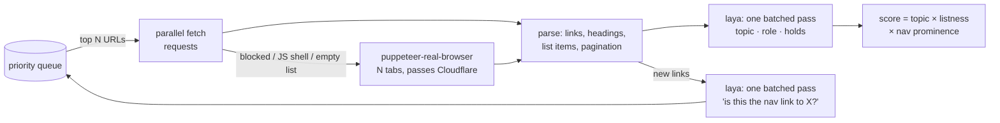

# laya-scraper

**Give it a homepage. It finds where the site keeps its publications and maps what each section holds.**

```
$ python scrape.py https://odi.org/en/
laya on cuda: NVIDIA GeForce RTX 4080 SUPER
[  1] 0.25 hub=0.30 hub     events        items=  8 requests https://odi.org/en/
[  2] 0.31 hub=0.31 listing organisation  items= 28 requests https://odi.org/en/about/our-work/
[  3] 0.23 hub=0.23 listing events        items= 20 requests https://odi.org/en/events/
[  4] 1.00 hub=1.00 listing publications  items= 20 browser  https://odi.org/en/publications/
[  5] 0.35 hub=0.97 item    publications  items=  2 requests https://odi.org/en/publications/beyond-sovereignty-...
...
{
  "answer": "https://odi.org/en/publications/",
  "sections": {
    "publications": "https://odi.org/en/publications/",
    "events": "https://odi.org/en/events/",
    "organisation": "https://odi.org/en/about/our-work/",
    ...
  }
}
```

There are no per-site rules, CSS selectors or keyword lists. The crawler reads pages much as a person would: the menu, the headings, and whether the page is a list of things. A small non-generative decision model, [laya](https://github.com/NandhaKishorM/laya), makes the judgment calls in milliseconds on the GPU.

## Results

The same code and settings were used on each site, with a budget of 30 pages:

| Site | Found | Score | Time | Notes |
|---|---|---|---|---|
| odi.org/en/ | [`/en/publications/`](https://odi.org/en/publications/) | 0.99 | ~33 s | The page is behind Cloudflare and its list loads with JS. Plain HTTP gets a 403, so the page is fetched with the real browser. |
| chathamhouse.org | [`/publications/research-publications`](https://www.chathamhouse.org/publications/research-publications) | 0.90 | ~34 s | The whole site is bot-walled, so it switches to browser-only. Its items live under dated paths (`/2025/12/…`), not under the list page. |
| brookings.edu | [`/research-commentary/`](https://www.brookings.edu/research-commentary/) | 0.38 | ~29 s | The list loads with JS and items live at `/articles/…`. It beats the homepage by a small margin. |

The full reports, with every page visited and classified, are in [`examples/`](examples/): `*.json` holds the report and `*.log` the crawl trace.

## How it works



1. **Best-first, batched crawl.** Each round takes the most promising URLs from a priority queue and fetches them in parallel.
2. **Two fetchers, chosen per page.** It tries plain `requests` first because it's fast. A page goes to a real Chrome, via [puppeteer-real-browser](https://www.npmjs.com/package/puppeteer-real-browser), when:
   - it is blocked (403/429/503),
   - it is a thin JS shell,
   - or laya says it's on-topic but the static HTML lists no items, which means the list loads with JS.

   If most of a batch is bot-walled, the whole site switches to the browser. The browser runs several tabs, and they share cookies, so a Cloudflare challenge is solved once per site.
3. **laya judges meaning.** Every page is classified in one batched pass:
   - **topic**: is this page about the target?
   - **role**: list, single item, hub or info page
   - **holds**: publications, news, events, people, jobs, media, projects, organisation or mixed
4. **Structure judges list pages.** List items are titled links in the main content, with nav, header and footer removed, grouped by path pattern with numbers wildcarded (`/2025/12/x` ≈ `/2026/01/y`). The page structure also contributes pagination and PDF/date counts.
5. **The final score** combines the three signals: `topic × (0.2 + 0.8·listness) × (0.6 + 0.4·prominence)`. Prominence is the share of crawled pages that link to the candidate. Real section indexes sit in the site menu; a one-off magazine issue doesn't.
6. **Link priority.** laya scores every new link ("is this the nav link to the site's publications?"). Links with many known pages beneath them get a boost. Once a list is confirmed, its entries are deprioritized, so the budget goes to finding new places instead of reading 30 individual reports.

### Why laya?

The crawler asks hundreds of small yes/no and multiple-choice questions per run. laya answers them in a single forward pass, with no text generation and no prompt parsing, and it batches them: a whole round of links is scored in one GPU call. It also runs on CPU, just slower. It is multilingual, so non-English sites work without changes.

## Quickstart

Needs Python 3.10+ and Node 18+.

```bash
python -m venv .venv
# NVIDIA GPU (recommended). Skip this line for CPU-only:
.venv/Scripts/python -m pip install torch --index-url https://download.pytorch.org/whl/cu128
.venv/Scripts/python -m pip install -r requirements.txt
npm install

.venv/Scripts/python test_parse.py          # structure self-check, no network → "ok"
.venv/Scripts/python scrape.py https://odi.org/en/
```

On macOS or Linux, use `.venv/bin/python`. The first run downloads the laya checkpoint.

### Options

| Flag | Default | |
|---|---|---|
| `--target` | `publications (research reports, papers, briefs)` | What to look for, e.g. `"job vacancies"` or `"press releases"` |
| `--max-pages` | 30 | Crawl budget |
| `--max-depth` | 3 | Maximum clicks from the start page |
| `--tabs` | 4 | Parallel fetches and browser tabs |
| `--browser` | `auto` | `always` or `never` force one fetcher |
| `--out` | – | Write the full JSON report of every page visited |

### Output

`answer` is the best URL. `sections` gives, per content type, the most prominent list page. `top` holds the 5 best candidates, and `places` (in `--out`) contains every page visited:

```json
{"url": "https://odi.org/en/publications/", "via": "browser", "depth": 1, "role": "listing",
 "holds": "publications", "hub": 0.9999, "items": 20, "linked_from": 0.967, "score": 0.9867}
```

## About headless and Cloudflare

Cloudflare fingerprints true headless Chrome in every mode (`headless: true`, `'new'`, `'shell'`). So by default the browser is a normal Chrome window placed off-screen, which you never see. On Linux, puppeteer-real-browser runs it under xvfb. `HEADLESS=1` forces true headless for sites without a challenge.

Two details made challenge handling reliable with several tabs at once:
- Chrome slows down background tabs, which stalled their challenges. The browser runs with that throttling turned off.
- A challenge can clear during the first page load while the recorded status stays 403. The renderer uses Cloudflare's `cf-mitigated` header to tell these cases from a real 403.

## Limitations and next steps

- **Weights are hand-tuned** on three sites. With 20–50 labelled sites they could be fitted, or laya could be fine-tuned on (page → is-hub) pairs; the laya repo ships a fine-tuning notebook.
- **`holds` labels are zero-shot and noisy.** For example, an experts page can come out as "news". The `answer` relies on the score, not these labels.
- **Query strings are dropped** to avoid `?page=` duplicates. This breaks sites that route pages by query (`?p=123`).
- **Pages reached by clicking** (infinite scroll buttons, faceted search) are not explored. The renderer only scrolls once.
- **Crawl politely.** There is no robots.txt handling or rate limiting yet. Keep `--tabs` modest on sites you don't own.

## Files

| | |
|---|---|
| [`scrape.py`](scrape.py) | Crawler, parser, laya "brain" and scoring (~300 lines) |
| [`render.js`](render.js) | Multi-tab real-browser worker, speaking JSON lines over stdin/stdout (~70 lines) |
| [`test_parse.py`](test_parse.py) | Structure checks (lists vs items vs nav, dated paths) |
| [`examples/`](examples/) | Reports and crawl traces for the three sites above |

## Credits

The decision model is [laya](https://github.com/NandhaKishorM/laya) by NandhaKishorM (Apache-2.0). Cloudflare-capable browsing comes from [puppeteer-real-browser](https://github.com/zfcsoftware/puppeteer-real-browser).

MIT licensed.
